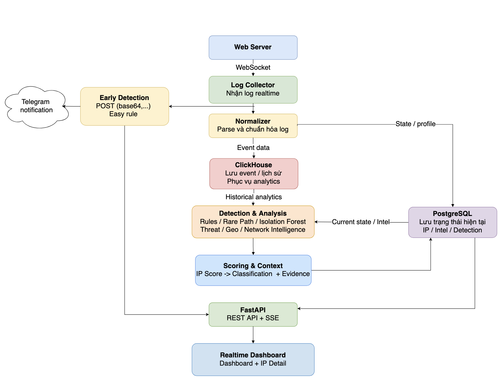

# Sentinel Hub

Hệ thống giám sát & phát hiện hành vi bất thường trên web server theo thời gian thực, kết hợp rule-based detection, ML (Isolation Forest), threat intelligence, local AI reasoning (giải thích thủ công) và market/region intelligence.

---

## Mục lục

- [Tech Stack](#tech-stack)
- [Kiến trúc tổng quan](#ki%E1%BA%BFn-tr%C3%BAc-t%E1%BB%95ng-quan)
- [Nguyên tắc thiết kế](#nguy%C3%AAn-t%E1%BA%AFc-thi%E1%BA%BFt-k%E1%BA%BF)
- [Pipeline](#pipeline)
    1. [Web Server](#1-web-server)
    2. [Log Collector](#2-log-collector)
    3. [Normalizer](#3-normalizer)
    4. [Data Storage](#4-data-storage)
    5. [Detection & Analysis](#5-detection--analysis)
    6. [Scoring & Classification](#6-scoring--classification)
    7. [Region / Market Intelligence](#7-region--market-intelligence)
    8. [FastAPI](#8-fastapi)
    9. [Realtime Dashboard](#9-realtime-dashboard)
- [Local AI Reasoner](#local-ai-reasoner)
- [Backup / Restore](#backup--restore)
- [Alerts](#alerts)
- [Hướng phát triển](#h%C6%B0%E1%BB%9Bng-ph%C3%A1t-tri%E1%BB%83n)

**Demo:** [Sensitive path](https://drive.google.com/drive/folders/1DvwZV9QClBiKu6J_3zBe2Hcmjzc0Sya7?usp=sharing)

---

## Tech Stack

|Thành phần|Công nghệ|
|---|---|
|Backend|Python, FastAPI|
|Event Storage|ClickHouse|
|State Storage|PostgreSQL|
|Log Transport|WebSocket|
|Realtime UI|Server-Sent Events (SSE)|
|Frontend|HTML, CSS, JavaScript|
|Detection|Rules, Rare Path|
|Machine Learning|Isolation Forest|
|Threat Intelligence|Geo, ASN, FireHOL, Tor, Proxy/VPN datasets|
|Market Intelligence|World Bank WDI, UN Comtrade, OSM/GHSL|

**Config:** biến môi trường trong `.env` (copy từ `.env.example`), chỉ điền credential cho service đang bật. `.env`, dataset sinh ra, cache Python, archive và report **không** được commit.

**Cấu trúc code chính:**

```
app/                         package chính (FastAPI, core, services, collectors...)
rules/behavior/              1 file JSON / rule, validate bởi rules/schema/
scripts/geo/ market/ ops/    scripts vận hành & migration (ngoài package app)
app/core/                    clock & failure-injection hooks (dùng ở runtime)
tests/fixtures/              helper test-only, không được import vào production
app/web/templates|static     frontend (đường dẫn cấu hình qua TEMPLATES_DIR/STATIC_DIR)
```

---

## Kiến trúc tổng quan



---

## Nguyên tắc thiết kế

- **Tách luồng realtime khỏi workload nặng** — Early Detection chỉ dùng rule nhẹ
    - state ngắn hạn trong memory; Rare Path, Isolation Forest, enrichment, market refresh, OSM processing chạy ngoài Collector hot path. Khi quá tải, ưu tiên giữ: Collector/ingest → Fast Detection/Early Alert → Durable storage/ checkpoint → mới tới deep/background analysis.
- **Không mất, không trùng log:** log chỉ được xác nhận sau khi lưu thành công; khi kết nối lại hoặc khởi động lại, các log đã xử lý sẽ được bỏ qua để tránh ghi và đếm trùng.
- **Backpressure thay vì drop:** mọi queue có giới hạn; storage chậm → áp dụng backpressure thay vì âm thầm mất log.
- **Tách lưu trữ theo workload:** ClickHouse = event bất biến/lịch sử/analytics; PostgreSQL = state hiện tại (IP profile, evidence, classification, job, intel).
- **Fail-isolated:** 1 job/nguồn lỗi không kéo sập cái khác (intel source, raw archive, backup component... đều retry/degrade độc lập).

---

## Pipeline

### 1. Web Server

Nguồn sinh log (IP, thời gian, method, path, status, User-Agent). Server chỉ có nhiệm vụ gửi log ra ngoài, không xử lý gì thêm.

### 2. Log Collector

Nhận log realtime qua **WebSocket**, hỗ trợ reconnect/replay để tránh mất log, xử lý trùng, hoặc sai lệch state sau khi mất kết nối.

**Raw log archive (song song với fast path):**

- Ghi raw access-log ra `data/raw-log-spool/<source>/<UTC date>/<hour>.log`, không chặn đường xử lý chính (`handle_message()`).
- File xoay theo giờ UTC hoặc khi đạt 128 MiB; chunk đã "seal" có sidecar JSON (nguồn, chunk ID, line/byte count) và không bao giờ bị ghi thêm.
- Queue nhận có giới hạn (10.000 dòng / 64 MiB); ≥70% báo `PRESSURE`, đầy thì từ chối cả batch (không mất log âm thầm) — client reconnect và replay từ checkpoint.
- Chunk đã seal được nén Zstandard (verify lossless) rồi upload lên Azure Blob (staged block upload + verify SHA-256 từ xa); file local chỉ xoá sau khi có manifest hoàn chỉnh.
- Job dọn dẹp cross-platform (`raw_log_archive_job`, kèm adapter launchd/Task Scheduler) drain artifact còn sót sau restart/outage.
- Lệnh replay độc lập (`replay_raw_archive`) để verify tính toàn vẹn chunk — chưa chứng minh byte-identity với `access.log` gốc trên Nginx.

**Fast Detection:** chỉ dùng path marker high-confidence (`/.env`, `/.git`, `wp-config.php`, `phpmyadmin`, `adminer`...), không chờ DB, không đổi classification, không sở hữu checkpoint.

### 3. Normalizer

Parse log thô thành cấu trúc thống nhất; chuẩn hoá path phục vụ traffic stats, detection và Rare Path Analysis.

### 4. Data Storage

|Storage|Vai trò|
|---|---|
|**ClickHouse**|Event bất biến, lịch sử truy cập, analytics theo thời gian|
|**PostgreSQL**|State hiện tại: IP profile, evidence, classification, job, intel, read-model|

### 5. Detection & Analysis

**Behavior Detection:**

- **Rules** — pattern đã biết: burst, brute-force, sensitive-path probing, nhiều 4xx (`WEB-BRUTE-001`, `WEB-BURST-001`, `WEB-SCAN-001`).
- **Rare Path** — URL/path hiếm gặp theo lịch sử; hiện chạy ở chế độ **shadow**, `severity: supporting`, `score_contribution: 0` — không tự quyết classification.
- **Isolation Forest** — phát hiện bất thường thống kê, chạy như Stage-2 periodic worker độc lập ngoài Collector hot path; kết quả lưu `ip_ai_scores`.
- **`PENTEST-DETECT-1A` (shadow-only)** — behavioral evidence bổ sung, chỉ dùng field sẵn có của access log, không body inspection / network lookup / DB query trên hot path:
    - Scanner User-Agent → _supporting context_ (không tự tạo alert).
    - Content-discovery sweep: ≥20 request, ≥15 canonical path, unique ratio ≥0.70, 4xx ratio ≥0.60 / 60s.
    - WordPress discovery: ≥3 family khác nhau / 120s.
    - Extension/backup fan-out: ≥3 variant của cùng base path / 60s.
    - Chỉ ghi metric để shadow-validate — **không** tạo Early Alert, Telegram, classification, risk score hay AI job. `WEB-SCAN-001` giữ nguyên semantic.

**Fast Detection correlation (Early Alert):** `IP → bounded window → threshold → preliminary alert`, có TTL + cooldown theo `(IP, rule)` để tránh alert storm. Chỉ tạo alert `preliminary`, không đổi Stage-2 score/classification/checkpoint.

**Threat Intelligence:** Geo/ASN, Hosting, VPN, Proxy, Tor, FireHOL, abuse feeds — cung cấp _context/supporting evidence_, không tự kết luận malicious.

**Tự động cập nhật dữ liệu intelligence** (`app/core/intel_updater.py`, chạy qua `scripts/ops/data_scheduler.py`, không nằm trong FastAPI/collector hot path):

- Mỗi nguồn có interval refresh riêng: FireHOL lists (24h), RIR delegated extended (APNIC/RIPE/ARIN/LACNIC/AFRINIC, 24h), geofeed (24h/168h tuỳ nguồn), X4B VPN/datacenter list (24h), Cloudflare datacenter range (24h), az0 VPN (24h), device/browser proxy signal (6h), SAPICS GeoIP release (`sapics_releases`, mặc định 24h, cấu hình qua `SAPICS_REFRESH_HOURS`).
- Chỉ chạy source nào đã "due" (dựa `last_run_at` + interval), source lần trước `failed/unavailable` luôn được coi là due để tự retry.
- Chạy song song bounded (`INTEL_UPDATE_CONCURRENCY`, mặc định 6), giữ PostgreSQL advisory lock (`ip-intelligence:run-due-sources`) để tránh 2 scheduler chạy chồng nhau cùng lúc.
- **Failure-isolated theo từng source** — 1 nguồn lỗi không chặn các nguồn khác; kết quả (status, error, records_upserted) persist vào bảng `intel_source_status` để theo dõi vận hành.
- GeoIP database (ip2region `.xdb` IPv4/IPv6, SAPICS MMDB) tải mới, verify checksum/format trước, chỉ atomic-replace file cũ sau khi verify thành công — không bao giờ thay bằng file tải dở/hỏng.

### 6. Scoring & Classification

|Nhóm|Ý nghĩa|Điểm|
|---|---|--:|
|**A — Behavior**|Request pattern, probing, burst, bot, lỗi HTTP|0–100|
|**B — Network Identity**|Tor +15, Proxy +10, VPN +8, Hosting +5|tối đa +25|
|**C — Trusted Network**|Mạng/tổ chức rõ ràng + hành vi thấp|−20|
|**D — Conflict Context**|Chỉ dùng khi đã có hành vi đáng ngờ|+0 → +5|
|**E — AI Anomaly**|Isolation Forest đủ mạnh|+8|
|**F — Campaign Correlation**|Nhiều IP cùng ASN, hành vi/path tương đồng|+0 → +5|

**Tier (lowercase trong code/API/DB: `unknown|good|low|medium|critical`):**

```
UNKNOWN   quá ít dữ liệu, chưa có behavior/network/AI signal
GOOD      0–9
LOW       10–29
MEDIUM    30–59, hoặc AI anomaly đủ điều kiện
CRITICAL  60–100, hoặc hard behavior (vd sensitive probing)
```

Mỗi kết quả đi kèm **Evidence** giải thích tín hiệu nào góp phần → xem [Unified Evidence](#local-ai-reasoner).

### 7. Region / Market Intelligence

Chấm điểm **tiềm năng thị trường theo quốc gia/khu vực/thành phố**, tách biệt hoàn toàn với security scoring.

```
Economic Potential = 40% Market Capacity + 60% Industrial Fit   (World Bank WDI)
Market Score       = 40% Economic Potential + 60% Machine Demand (UN Comtrade)
```

- **Local Opportunity** tính theo H3 cell từ OSM + evidence phụ trợ, tách riêng Woodworking / Metal Fabrication; thiếu evidence → `insufficient_local_evidence` (không hiển thị điểm giả).
- **Area & City:** membership H3 ↔ khu vực hành chính / đô thị (GHSL UCDB), summary theo `snapshot × area|city × track`, calibration percentile theo peer group (`track × area_type`), chọn method Percentile vs Robust-Z dựa trên rank correlation.
- **Overlap/Whitespace:** overlap hai chiều + remaining opportunity giữa các area chia sẻ H3 cell — tính bounded theo worker định kỳ, không N² toàn cục.
- `/api/regions/{country_code}` chỉ **đọc** read model đã persist — không tính toán trong request.
- UI Region Detail hiển thị điểm đã calibrate, percentile, evidence status; thiếu hierarchy → `unavailable` (không giả `0%`).
- **Global expansion:** Wave 1 gồm 20 quốc gia, có cache guard (9/10 GiB), retention dry-run/apply, download atomic/resumable qua HTTP Range.

### 8. FastAPI

```
REST API  → traffic, IP profile, evidence, region data...
SSE       → đẩy thay đổi realtime lên Dashboard
```

IP Detail chỉ enrich lại khi state chưa hoàn tất hoặc user chủ động refresh; thiếu field không tự tạo vòng lặp enrichment.

### 9. Realtime Dashboard

- **Overview:** donut phân loại (Low/Medium/Critical/Unclassified) + Top IPs + Top paths + System Health, dùng chung time window (mặc định 24h, đổi preset cập nhật đồng bộ cả 4 metric). Traffic timeline vẽ request theo Medium/Critical.
- **Global map** (`/map`, chỉ ở Overview): kết hợp market opportunity + security evidence theo quốc gia/thành phố; marker dùng tier cao nhất làm màu tâm, ring thể hiện tier còn lại; zoom load city aggregate thật.
- **IP Intelligence / IP Detail:** bảng điều tra identity + evidence chi tiết + Explain (AI) thủ công.
- **Region Detail:** local opportunity + overlap theo area/city.
- Trang khác: Rare Path Evidence, Threat Intelligence, Data Freshness, What Changed, Collector Health, [Alerts](#alerts).

---

## Local AI Reasoner

```
Detection → Structured Evidence (Unified Evidence) → Local AI → Explanation
```

AI hỗ trợ **giải thích/tổng hợp**, không nằm trong ingest hot path, không tự đổi classification/risk, không điều khiển Web Server.

- **Unified Evidence** (`app/core/evidence.py`): contract chung cho rule, rare path, Isolation Forest, privacy, reputation, geo/network — `evidence_id` deterministic từ nội dung.
- **`CasePacket`** (`app/services/case_packets.py`): bounded, deterministic, tối đa 20 representative request; loại bỏ query string/metadata nhạy cảm; không tự truy cập PostgreSQL/ClickHouse/network/AI.
- Provider gọi `llama-server` (Foundation-Sec GGUF) cục bộ qua HTTP; JSON-Schema constrained decoding, timeout hữu hạn, output budget mặc định 256 token, **không retry**. Evidence-view riêng cho inference có budget giới hạn (model không thể cite evidence bị loại khỏi budget).
- Job qua PostgreSQL: `pending → running → completed/failed`, dedupe theo `(case_id, evidence_fingerprint)`. Worker (`run_explain_worker`) claim job bằng `FOR UPDATE SKIP LOCKED`, concurrency = 1, không retry trong cùng job.
- API: `POST /api/ai/cases/{case_id}/explain` (tạo/reuse job, trả `202`) và `GET /api/ai/jobs/{job_id}` (chỉ trả analysis khi `completed` + validated). Raw model output **không** bao giờ được lưu/trả về.
- **Semantic auto-trigger:** đã có contract (PostgreSQL cursor, dedupe, backlog cap 100 IP) nhưng consumer **disabled by default** — chưa tự tạo AI job.
- Bộ công cụ offline riêng cho eval (không chạy trong runtime): build corpus, benchmark, capture review, chấm điểm thủ công.

---

## Backup / Restore

Tất cả là **CLI thủ công**, không chạy trong FastAPI lifecycle. Secrets luôn qua env file ngoài repo, không log/print.

- **PostgreSQL:** `pg_dump --format=custom` stream thẳng lên Azure Block Blob (không ghi file dump đầy đủ ra local); retry = 0 ở giai đoạn đầu.
- **ClickHouse:** `BACKUP ... TO File(...)` native (không fallback CSV/JSON) → upload + verify SHA-256 lên Azure; xoá local chỉ sau khi có manifest.
- **PITR:** WAL archiving liên tục vào spool local → hourly WAL shipper upload Azure (verify SHA-256) → `pg_basebackup` (gzip, streamed) làm physical base backup thủ công, off-peak.
- **Retention:** dry-run trước; giữ 7 ngày gần nhất + 4 tuần ISO + 3 tháng gần nhất (union); chỉ báo `KEEP / DELETE_CANDIDATE / PROTECTED`, không tự gọi Azure delete. Có bộ test synthetic riêng chạy trên prefix cô lập.

---

## Alerts

`/alerts` — analyst inbox riêng (PostgreSQL), tách khỏi classification:

- Chỉ ghi các **chuyển severity có ý nghĩa** (lên `low/medium/critical`); không dùng Telegram outbox làm nguồn sự thật.
- Filter theo severity/status, acknowledge/resolve, click mở IP Detail; poll khi trang đang mở.
- Toggle tự động sinh AI explanation cho Critical mới — **mặc định tắt**, không replay sự kiện cũ, dùng chung AI worker (concurrency 1). Rate-limit 1 alert/IP/30 phút khi evidence thay đổi đáng kể; evidence giống hệt → dedupe.

---

## Hướng phát triển

- Parameter discovery & injection evidence (Stage 2, cần query parsing riêng).
- `AUTOMATED_PENTEST_SEQUENCE` — behavioral correlation nhiều bước.
- Mở rộng tiềm năng mua hàng theo từng thành phố (thêm nguồn dữ liệu mới).

