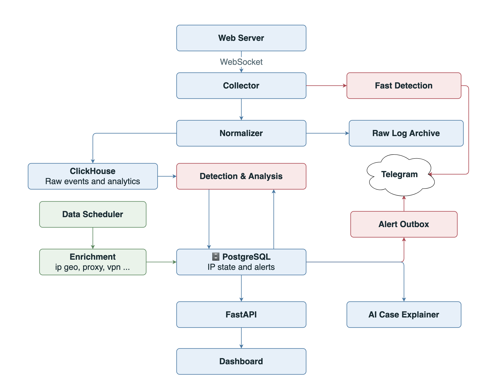

# Sentinel Hub

Hệ thống giám sát & phát hiện hành vi bất thường trên web server theo thời gian thực, kết hợp rule-based detection, ML (Isolation Forest), threat intelligence, local AI reasoning (giải thích thủ công) và market/region intelligence.

---

## Mục lục

- [Tech Stack](#tech-stack)
- [Kiến trúc tổng quan](#ki%E1%BA%BFn-tr%C3%BAc-t%E1%BB%95ng-quan)
- [Nguyên tắc thiết kế](#nguy%C3%AAn-t%E1%BA%AFc-thi%E1%BA%BFt-k%E1%BA%BF)
- [Pipeline](#pipeline)
    1. [Web Server](#1-web-server)
    2. [Log Collector](#2-log-collector)
    3. [Normalizer](#3-normalizer)
    4. [Data Storage](#4-data-storage)
    5. [Detection & Analysis](#5-detection--analysis)
    6. [Scoring & Classification](#6-scoring--classification)
    7. [Region / Market Intelligence](#7-region--market-intelligence)
    8. [FastAPI](#8-fastapi)
    9. [Realtime Dashboard](#9-realtime-dashboard)
- [Local AI Reasoner](#local-ai-reasoner)
- [Backup / Restore](#backup--restore)
- [Alerts](#alerts)

**Demo:** [Sensitive path](https://drive.google.com/drive/folders/1DvwZV9QClBiKu6J_3zBe2Hcmjzc0Sya7?usp=sharing)

---

## Tech Stack

|Thành phần|Công nghệ|
|---|---|
|Backend|Python, FastAPI|
|Event Storage|ClickHouse|
|State Storage|PostgreSQL|
|Log Transport|WebSocket|
|Realtime UI|Server-Sent Events (SSE)|
|Frontend|HTML, CSS, JavaScript|
|Detection|Rules, Rare Path|
|Machine Learning|Isolation Forest|
|Threat Intelligence|Geo, ASN, FireHOL, Tor, Proxy/VPN datasets|
|Market Intelligence|World Bank WDI, UN Comtrade, FAOSTAT, ILOSTAT, BGS World Mineral Statistics, OSM/GHSL|

**Config:** biến môi trường trong `.env` (copy từ `.env.example`), chỉ điền credential cho service đang bật. `.env`, dataset sinh ra, cache Python, archive và report **không** được commit.

**Reproducible Python environment:** `uv.lock` pins the resolved dependency
graph for Python 3.11+. Release/build environments should use `uv sync --locked`
and must fail if the lockfile is out of date; local development may continue
with the existing virtualenv workflow.

**Production preflight:** before exposing an instance, run
`python scripts/ops/validate_production_config.py`. It requires PostgreSQL and
ClickHouse configuration, proxy authentication with explicit trusted CIDRs,
security headers, and explicit trusted hosts without wildcard entries. It
does not print or validate credential values.

**Cấu trúc code chính:**

```
app/                         package chính (FastAPI, core, services, collectors...)
app/db/repositories.py      compatibility facade cho profile, geo, intelligence, disposition
app/db/detection_repository.py detection feature aggregation, rules và atomic PG detection transaction
app/db/state_repository.py  dashboard IP inventory, summary và change-feed read models
app/db/region_repository.py country profile và qualified-traffic context
app/db/market_repository.py market identity, catalog và publication facade
app/db/market_evidence_repository.py OSM/H3/local evidence, calibration và area/city rollups
app/db/market_demand_repository.py RFQ, product priors, industrial và country-demand snapshots
app/db/alert_repository.py  alert persistence, cursor pagination và outbox
app/db/json_codec.py        adapter JSONB và serialization ổn định dùng chung
rules/behavior/              1 file JSON / rule, validate bởi rules/schema/
scripts/geo/ market/ ops/    scripts vận hành & migration (ngoài package app)
app/core/                    clock & failure-injection hooks (dùng ở runtime)
tests/fixtures/              helper test-only, không được import vào production
app/web/templates|static     frontend (đường dẫn cấu hình qua TEMPLATES_DIR/STATIC_DIR)
```

---

## Kiến trúc tổng quan



---

## Nguyên tắc thiết kế

- **Tách luồng realtime khỏi workload nặng** — Early Detection chỉ dùng rule nhẹ
    - state ngắn hạn trong memory; Rare Path, Isolation Forest, enrichment, market refresh, OSM processing chạy ngoài Collector hot path. Khi quá tải, ưu tiên giữ: Collector/ingest → Fast Detection/Early Alert → Durable storage/ checkpoint → mới tới deep/background analysis.
- **Không mất, không trùng log:** log chỉ được xác nhận sau khi lưu thành công; khi kết nối lại hoặc khởi động lại, các log đã xử lý sẽ được bỏ qua để tránh ghi và đếm trùng.
- **Backpressure thay vì drop:** mọi queue có giới hạn; storage chậm → áp dụng backpressure thay vì âm thầm mất log.
- **Tách lưu trữ theo workload:** ClickHouse = event bất biến/lịch sử/analytics; PostgreSQL = state hiện tại (IP profile, evidence, classification, job, intel).
- **Change-feed retention:** `ip_change_log` được giới hạn bởi maintenance task riêng trong `data_scheduler`; AI scoring chỉ ghi semantic changes, không dọn durable feed.
- **Data refresh scheduler:** chạy ngoài vòng đời FastAPI; cấu hình macOS nằm ở mục riêng bên dưới. `scripts/dev_run.sh` không khởi chạy scheduler.
- **Giải thích market score:** Region Profile giải thích cả cấp quốc gia và khu vực bằng các thành phần đã lưu (product demand, OSM sector features, industrial land, access observations, economic potential và machinery imports); đây là market/commercial context, tách biệt với security risk.
- **Geo conflict:** Operational country, city, coordinates, RIR registration và ip2region context được giữ thành các lớp riêng. Khi nguồn mâu thuẫn, hệ thống hiển thị `resolved_with_conflict` và giữ candidate; không tự gán một city hoặc thay đổi security classification chỉ vì geo disagreement.
- **IP Detail hierarchy:** IP traffic appears before the compact `Why this verdict?` score explanation; network location separates the operational result from source candidates and conflict context so live investigation remains the primary view.
- **IP Detail investigation tabs:** `Overview`, `Activity`, `Detections`, `Evidence`, and `Intel` organize the existing case data client-side while keeping the summary visible and avoiding extra API requests or full-page rerenders.
- **IP Detail overview:** Overview summarizes the current assessment, activity span, request/error volume, and active score contributions. Classification history lists each saved label transition with its source, before/after score, and evidence snapshot; old change-log entries without evidence are marked as incomplete. Detections stays expanded for direct reading; Evidence uses a two-column layout on desktop and collapses responsively on smaller screens.
- **Fail-isolated:** 1 job/nguồn lỗi không kéo sập cái khác (intel source, raw archive, backup component... đều retry/degrade độc lập).

---

## Data refresh scheduler

On macOS, the scheduler can run as a per-user LaunchAgent, independently of
the FastAPI process. `RunAtLoad` runs one pass at login; `StartInterval` repeats
it using `DATA_SCHEDULER_INTERVAL_SECONDS`. The scheduler's persisted due-state
prevents every launch from forcing every provider refresh, and its process lock
prevents overlapping passes. PostgreSQL and ClickHouse must still be running
for jobs that depend on them. A LaunchAgent runs after user login, not before
login at boot.

With `.env` configured, write the plist and load it into the current user
session:

```sh
python -m scripts.ops.data_scheduler_launchd --install
launchctl bootstrap "gui/$(id -u)" "$HOME/Library/LaunchAgents/com.sentinel.data-scheduler.plist"
launchctl print "gui/$(id -u)/com.sentinel.data-scheduler"
```

To unload and remove it:

```sh
launchctl bootout "gui/$(id -u)" "$HOME/Library/LaunchAgents/com.sentinel.data-scheduler.plist"
python -m scripts.ops.data_scheduler_launchd --uninstall
```

Changing `DATA_SCHEDULER_INTERVAL_SECONDS` requires regenerating the plist and
reloading the agent. `DATA_SCHEDULER_ENABLED=false` makes each invocation exit
without starting a refresh pass. Logs are written under `data/logs/`; the
one-shot runner can also be invoked directly with
`python -m scripts.ops.data_scheduler`.

The shared intelligence updater is disabled by default
(`INTEL_UPDATER_ENABLED=false`). When explicitly enabled, it refreshes SAPICS
through the existing intelligence schedule; otherwise
`SAPICS_UPDATER_ENABLED` controls SAPICS's independent fallback schedule.
`IP2REGION_UPDATER_ENABLED` controls ip2region refreshes. Both local database
refresh intervals default to 24 hours. Their startup-time network downloads
were removed from `scripts/dev_run.sh`; failed downloads leave the previous
validated files in place.

---

## Pipeline

### 1. Web Server

Nguồn sinh log (IP, thời gian, method, path, status, User-Agent). Server chỉ có nhiệm vụ gửi log ra ngoài, không xử lý gì thêm.

### 2. Log Collector

Nhận log realtime qua **WebSocket**, hỗ trợ reconnect/replay để tránh mất log, xử lý trùng, hoặc sai lệch state sau khi mất kết nối.

Collector giữ vai trò điều phối lifecycle và status. Session/lease/reconnect nằm
trong `app/collectors/session.py`; batch intake và source-offset buffering ở
`batching.py`; queue, drain và ordered commit/retry ở `storage.py`; enrichment
và privacy refresh có worker/state riêng trong `background.py`.

**Raw log archive (song song với fast path):**

- Mỗi raw batch được ghi vào spool và `fsync` hoàn tất trước khi downstream xử lý hoặc checkpoint được xác nhận. Nếu archive từ chối nhận hoặc ghi thất bại, batch không nhận durability acknowledgement bình thường; source offset không được xác nhận tiến lên.
- File xoay theo giờ UTC hoặc khi đạt 128 MiB; chunk đã "seal" có sidecar JSON (nguồn, chunk ID, line/byte count) và không bao giờ bị ghi thêm.
- Queue nhận có giới hạn (10.000 dòng / 64 MiB); ≥70% báo `PRESSURE`, đầy hoặc disk guard từ chối thì không mất log âm thầm — client reconnect và replay từ checkpoint.
- Lifecycle: `raw batch → durable spool write + fsync → sealed chunk → verified zstd compression → independent destination state`.
- Hai destination có durable sidecar state độc lập: **LOCAL** `pending / failed / verified`; **AZURE** `pending / failed / verified`. Thành công ở một destination không khiến destination đó bị copy/upload lại khi destination kia retry thất bại.
- **Local copy:** chunk được ghi vào file tạm `.tmp`, `fsync`, xác minh size/SHA-256 rồi atomic rename. File đích đã tồn tại cũng được xác minh size/checksum trước khi chấp nhận.
- **Azure:** chunk được upload bằng staged blocks và xác minh SHA-256 từ xa. Nếu object đã commit nhưng manifest chưa được ghi trước khi process dừng, retry sẽ tìm deterministic object, xác minh bytes + SHA-256, rồi ghi manifest mà không upload object lần nữa. Object hoặc manifest hiện hữu nhưng không khớp chunk sẽ gây lỗi rõ ràng; hệ thống không âm thầm ghi đè.
- Khi Azure outage hoặc chưa cấu hình Azure/SDK, local copy vẫn có thể được verify nhưng Azure ở `pending/failed`; spool được giữ lại. Vì vậy spool và local copy có thể cùng chiếm disk cho đến khi Azure hoạt động. Disk guard có thể chặn ingestion mới nếu tình trạng kéo dài; đây là hành vi bảo toàn dữ liệu có chủ ý.
- Cleanup spool chỉ chạy khi local đã `verified` hoặc được cấu hình `disabled`, **và** Azure đã `verified`. Khi local backup bật, final manifest chứa proof của cả hai destination phải được ghi bền vững cạnh file local `.zst` trước khi dọn spool.
- Local retention mặc định là **7 ngày**. Chỉ xóa local `.zst` hết hạn khi final manifest ghi local và Azure đều `verified`, đồng thời file vẫn khớp bytes/SHA-256 đã ghi nhận. Retention local không thay thế độ bền của Azure.
- Disk guard giữ mặc định **2 GiB** dung lượng trống dự trữ và cập nhật phép đo theo chu kỳ **10 giây**. Với bản local copy mới, yêu cầu dung lượng là `reserve + compressed chunk size`; nếu bản đã tồn tại và được xác minh, không dự trữ kích thước chunk lần nữa. Khi không đủ reserve, raw admission bị chặn, không có durability receipt thành công và checkpoint bình thường không tiến lên. Archive writer health làm `/health` chuyển degraded; trạng thái tự hồi phục sau khi dung lượng trống trở lại. Không tự xóa dữ liệu để giải phóng disk và local backups còn trong retention được bảo vệ.
- Thư mục local backup có thể đặt trên filesystem khác. Nếu ở cùng physical disk với spool thì bản copy chỉ giúp khôi phục khỏi lỗi phần mềm/operator hoặc khi cần lấy lại archive gần đây; nó **không** bảo vệ trước hỏng ổ đĩa. Azure là bản off-machine.
- Job dọn dẹp cross-platform (`raw_log_archive_job`, kèm adapter launchd/Task Scheduler) drain artifact còn sót sau restart/outage.
- Lệnh replay độc lập (`replay_raw_archive`) để verify tính toàn vẹn chunk — chưa chứng minh byte-identity với `access.log` gốc trên Nginx.

**Fast Detection:** chỉ dùng path marker high-confidence (`/.env`, `/.git`, `wp-config.php`, `phpmyadmin`, `adminer`...), không chờ DB, không đổi classification, không sở hữu checkpoint.

### 3. Normalizer

Parse log thô thành cấu trúc thống nhất; chuẩn hoá path phục vụ traffic stats, detection và Rare Path Analysis.

### 4. Data Storage

|Storage|Vai trò|
|---|---|
|**ClickHouse**|Event bất biến, lịch sử truy cập, analytics theo thời gian|
|**PostgreSQL**|State hiện tại: IP profile, evidence, classification, job, intel, read-model|

### 5. Detection & Analysis

**Behavior Detection:**

- **Rules** — pattern đã biết: burst, brute-force, sensitive-path probing, nhiều 4xx (`WEB-BRUTE-001`, `WEB-BURST-001`, `WEB-SCAN-001`).
- **Rare Path** — URL/path hiếm gặp theo lịch sử; hiện chạy ở chế độ **shadow**, `severity: supporting`, `score_contribution: 0` — không tự quyết classification.
- **Isolation Forest** — phát hiện bất thường thống kê, chạy như Stage-2 periodic worker độc lập ngoài Collector hot path; kết quả lưu `ip_ai_scores`.

**Fast Detection correlation (Early Alert):** `IP → bounded window → threshold → preliminary alert`, có TTL + cooldown theo `(IP, rule)` để tránh alert storm. Chỉ tạo alert `preliminary`, không đổi Stage-2 score/classification/checkpoint.

**Threat Intelligence:** Geo/ASN, Hosting, VPN, Proxy, Tor, FireHOL, abuse feeds — cung cấp _context/supporting evidence_, không tự kết luận malicious.

- **Failure-isolated theo từng source** — 1 nguồn lỗi không chặn các nguồn khác
### 6. Scoring & Classification

|Nhóm|Ý nghĩa|Điểm|
|---|---|--:|
|**A — Behavior**|Request pattern, probing, burst, bot, lỗi HTTP|0–100|
|**B — Network Identity**|Tor +15, Proxy +10, VPN +8, Hosting +5|tối đa +25|
|**C — Trusted Network**|Mạng/tổ chức rõ ràng + hành vi thấp|−20|
|**D — Conflict Context**|Chỉ dùng khi đã có hành vi đáng ngờ|+0 → +5|
|**E — AI Anomaly**|Isolation Forest đủ mạnh|+8|
|**F — Campaign Correlation**|Nhiều IP cùng ASN, hành vi/path tương đồng|+0 → +5|

**Tier (lowercase trong code/API/DB: `unknown|good|low|medium|critical`):**

```
UNKNOWN   quá ít dữ liệu, chưa có behavior/network/AI signal
GOOD      0–9
LOW       10–29
MEDIUM    30–59, hoặc AI anomaly đủ điều kiện
CRITICAL  60–100, hoặc hard behavior (vd sensitive probing)
```

Mỗi kết quả đi kèm **Evidence** giải thích tín hiệu nào góp phần → xem [Unified Evidence](#local-ai-reasoner).

Behavior score dùng aggregation theo evidence family bằng family-max. V1 vẫn được
tính để đo chênh lệch trên cùng `detections_recent`, nhưng không còn công tắc runtime
để chuyển production về V1; rollback cần khôi phục code. Family-max chỉ thay
aggregation của A; rule points, các thành phần B–E, ngưỡng, hard-sensitive Critical
và confidence được giữ nguyên. Nếu thiếu `detections_recent`, classification tạm
fallback sang V1 và ghi metric. Trong 128 lượt production family-max đã quan sát,
delta đều bằng 0 và behavior score đều bằng 0; chưa có bằng chứng về accuracy hay
trường hợp nhiều rule cùng family.

### 7. Region / Market Intelligence

Chấm điểm **tiềm năng thị trường theo quốc gia/khu vực/thành phố**, tách biệt hoàn toàn với security scoring.

Traffic trong Potential Markets dùng cùng country-demand snapshot và cohort cho
quốc gia lẫn phân rã tỉnh Việt Nam. `qualified_http_requests` đếm request HTTP
được giữ lại theo eligibility hiện hành; các request không có province
attribution rõ ràng được cộng vào `Unmapped / unknown city`. Tổng request theo
tỉnh cộng Unmapped phải bằng tổng ở cấp Việt Nam. `Coverage` vẫn biểu thị độ
bao phủ market evidence, không phải độ bao phủ địa lý.
Đối với traffic Việt Nam, nhãn city/district của nguồn GeoIP được quy lên đơn
vị tỉnh/thành chuẩn của ứng dụng qua trường admin parent (`state`), rồi mới
gom vào hàng tỉnh. Vì vậy district của DB-IP như `Quan Binh Thanh` có thể được
hiển thị dưới Hồ Chí Minh dù tên city khác GeoLite2; dữ liệu MMDB không bị sửa
và nhãn gốc vẫn nằm trong candidate evidence. Parent thiếu, không nhận diện
được hoặc các nguồn bất đồng thì traffic vẫn nằm ở `Unmapped / unknown city`.
Đây là phân bổ traffic theo tỉnh/thành, không khẳng định city chính xác.

```
Economic Potential = 40% Market Capacity + 60% Industrial Fit   (World Bank WDI)
Market Score       = 40% Economic Potential + 60% Machine Demand (UN Comtrade)
```


### 8. FastAPI

```
REST API  → traffic, IP profile, evidence, region data...
SSE       → đẩy thay đổi realtime lên Dashboard
```

IP Detail chỉ enrich lại khi state chưa hoàn tất hoặc user chủ động refresh; thiếu field không tự tạo vòng lặp enrichment.

### 9. Realtime Dashboard

- **Overview:** donut phân loại (Low/Medium/Critical/Unclassified) + Top IPs + Top paths + System Health, dùng chung time window (mặc định 24h, đổi preset cập nhật đồng bộ cả 4 metric). Traffic timeline vẽ request theo Medium/Critical.
- **Potential markets:** đổi kỳ 7d/30d/90d vẫn giữ scope quốc gia đang chọn; chọn Việt Nam tiếp tục hiển thị phân rã tỉnh theo kỳ đó.
- **Global map** (`/map`, chỉ ở Overview): kết hợp market opportunity + security evidence theo quốc gia/thành phố; marker dùng tier cao nhất làm màu tâm, ring thể hiện tier còn lại; zoom load city aggregate thật.
- **IP Intelligence / IP Detail:** bảng điều tra identity + evidence chi tiết + Explain (AI) thủ công.
- **Raw Log Tail:** xem log thô dạng từng dòng, mở lịch sử 1h/6h/12h/24h, gợi ý IP theo prefix/status trong cửa sổ đang chọn, cuộn lên đầu khung để tự tải trang log cũ và nhận log mới ở cuối khung cuộn.
- **Region Detail:** local opportunity + overlap theo area/city.
- Trang khác: Rare Path Evidence, Threat Intelligence, Data Freshness, What Changed, Collector Health, [Alerts](#alerts).

---

## Local AI Reasoner

```
Detection → Structured Evidence (Unified Evidence) → Local AI → Explanation
```

AI hỗ trợ **giải thích/tổng hợp**, không nằm trong ingest hot path, không tự đổi classification/risk, không điều khiển Web Server.
- Foundation-Sec là bounded optional explainer, không phải dependency của detection, classification, risk scoring, alerts hay collector. Các quyết định security vẫn dựa trên pipeline deterministic và evidence hiện có khi AI unavailable hoặc abstain.
- `LOCAL_REASONING_MAX_INPUT_TOKENS` là eligibility budget theo estimated prompt tokens: `0` (mặc định) fail-closed và abstain trước khi gọi model; giá trị dương `N` chỉ cho phép packet có estimate `<= N`. Ngưỡng production dương hiện **chưa được calibration**.
- Trạng thái được giữ riêng: `too_large` nghĩa là vượt giới hạn context an toàn của model; `abstained` với `local_reasoning_budget_exceeded` nghĩa là không đủ eligibility theo ngân sách reasoning CPU; `timeout` nghĩa là model đã được gọi nhưng không trả lời trong thời hạn. Abstention không phải provider failure và không làm thay đổi detection/risk.
- Provider gọi `llama-server` (Foundation-Sec GGUF) cục bộ qua HTTP; JSON-Schema constrained decoding, timeout hữu hạn, output budget mặc định 768 token, **không retry**. Evidence-view riêng cho inference có budget giới hạn (model không thể cite evidence bị loại khỏi budget).
- Các công cụ offline có profile riêng để giới hạn chi phí chạy: `evaluate_cases.py` dùng server đã chạy sẵn, mặc định timeout 30 giây mỗi case và output budget thực của provider (768 token nếu không cấu hình); metadata context ghi cấu hình server (`FOUNDATION_SEC_CONTEXT_SIZE`, mặc định 8192), không phải provider safety fallback. `capture_case_review.py` khởi chạy server độc lập cho từng case và có fallback profile riêng: timeout 120 giây, 256 token, context 4096, tối đa 60 lần readiness check. Đây không phải cấu hình worker production; artifact ghi lại các giá trị đã resolve từ CLI/environment.
- Job qua PostgreSQL: `pending → running → completed/failed/abstained`, dedupe theo `(case_id, evidence_fingerprint)`. Worker (`run_explain_worker`) claim job bằng `FOR UPDATE SKIP LOCKED`, concurrency = 1, không retry trong cùng job.
- **Semantic auto-trigger:** đã có contract (PostgreSQL cursor, dedupe, backlog cap 100 IP) nhưng consumer **disabled by default** — chưa tự tạo AI job.

---

## Backup / Restore

Tất cả là **CLI thủ công**, không chạy trong FastAPI lifecycle. Secrets luôn qua env file ngoài repo, không log/print.

- **PostgreSQL:** `pg_dump --format=custom` stream thẳng lên Azure Block Blob (không ghi file dump đầy đủ ra local); retry = 0 ở giai đoạn đầu.
- **ClickHouse:** `BACKUP ... TO File(...)` native (không fallback CSV/JSON) → upload + verify SHA-256 lên Azure; xoá local chỉ sau khi có manifest.
- **Raw-First Recovery:** raw access-log được archive immutable, nén và upload Azure kèm checksum/manifest; khi cần khôi phục, hệ thống replay raw log để tái tạo ClickHouse events và detection state. PostgreSQL mutable state được bảo vệ bằng logical dump định kỳ trong backup set; không còn Continuous WAL/PITR.
- **Recovery contract:** logical PostgreSQL dump mặc định có RPO theo chu kỳ backup (mục tiêu hằng ngày); raw replay không khôi phục chính xác các thay đổi mutable phát sinh sau dump gần nhất như analyst state, alert state hoặc AI job state. Raw archive phải được verify và replay idempotent trước khi coi là backup hợp lệ.
- **Retention:** dry-run trước; giữ 7 ngày gần nhất + 4 tuần ISO + 3 tháng gần nhất (union); chỉ báo `KEEP / DELETE_CANDIDATE / PROTECTED`, không tự gọi Azure delete. Có bộ test synthetic riêng chạy trên prefix cô lập.

---

## Alerts

`/alerts` — analyst inbox riêng (PostgreSQL), tách khỏi classification:

- Chỉ ghi các **chuyển severity có ý nghĩa** (lên `low/medium/critical`); không dùng Telegram outbox làm nguồn sự thật.
- Disposition tự động: `NEW + Medium → MONITOR`, `NEW + Critical → INVESTIGATE`; `MONITOR + Critical → INVESTIGATE`. Medium tái diễn chỉ tạo alert `monitored_recurrence` và chuyển sang `INVESTIGATE` khi evidence fingerprint mới và đã qua cooldown 30 phút. `INVESTIGATE`, `ESCALATE`, `RESOLVED` không bị automation ghi đè; `ESCALATE` vẫn do analyst quản lý.
- Filter theo severity/status, acknowledge/resolve, click mở IP Detail; poll khi trang đang mở.
- Toggle tự động sinh AI explanation cho Critical mới — **mặc định tắt**, không replay sự kiện cũ, dùng chung AI worker (concurrency 1). Rate-limit 1 alert/IP/30 phút khi evidence thay đổi đáng kể; evidence giống hệt → dedupe.
